# Двухсервисная система LLM-консультаций

# О проекте

Это приложение реализует распределённую схему из двух самостоятельных сервисов:

1. **Auth Service** - сервис для регистрации пользователей, входа и выпуска JWT
2. **Bot Service** - Telegram-бот, который отправляет пользовательские вопросы в LLM через OpenRouter

Сервисы разделены по зонам ответственности. Auth Service работает с пользователями и токенами, а Bot Service не хранит учётные записи и принимает запросы только при наличии корректного JWT.

# Auth Service

Auth Service отвечает за пользовательскую авторизацию и генерацию JWT. Его можно использовать отдельно от Telegram-бота, например как самостоятельный backend для внешних клиентов.

Swagger UI доступен по адресу http://localhost:8000/docs.

| Endpoint | Метод | Назначение |
|----------|-------|------------|
| `/auth/register` | POST | Создание нового пользователя |
| `/auth/login` | POST | Проверка логина/пароля и выдача JWT |
| `/auth/me` | GET | Получение данных текущего пользователя |
| `/health` | GET | Healthcheck сервиса |

- Пароли не сохраняются в открытом виде, используется хеширование через `bcrypt`
- В JWT записываются поля `sub` (id пользователя), `role`, `iat`, `exp`
- Входные данные проверяются Pydantic-схемами
- Для работы с БД используется `SQLAlchemy` в асинхронном режиме с SQLite через `aiosqlite`
- Ошибки HTTP обрабатываются через собственные исключения

# Bot Service

Bot Service предоставляет Telegram-интерфейс для общения с LLM. Он не занимается регистрацией, не выполняет логин и не подключается к базе данных Auth Service. Доступ разрешается только по подписанному и не просроченному JWT.

| Команда | Назначение |
|---------|------------|
| `/start` | Отправляет приветствие и краткий порядок работы |
| `/token <JWT>` | Проверяет JWT и сохраняет его в Redis с привязкой к `user_id` |
| Любой текст | Создаёт LLM-запрос, если у пользователя уже сохранён валидный токен |

- Telegram Bot (`aiogram`) принимает сообщения через polling и проверяет JWT: подпись, срок действия и наличие `sub`
- Celery Worker забирает задачи из RabbitMQ, вызывает OpenRouter API и отправляет результат пользователю через Telegram Bot API; при временных ошибках выполняются повторы
- RabbitMQ используется как брокер задач между ботом и worker-процессом
- Redis хранит JWT для Telegram-пользователей по ключам `token:{user_id}` с TTL 1 час

### **Bot API (FastAPI)**

Дополнительный HTTP-сервер используется для проверки состояния Bot Service. Healthcheck доступен по адресу http://localhost:8001/health (`GET /health`).

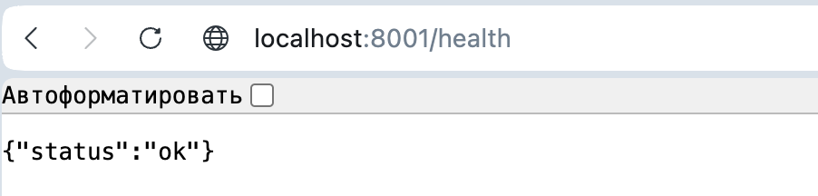

# Как работает сценарий

1. **Регистрация** - пользователь открывает Swagger UI (`http://localhost:8000/docs`) и отправляет `POST /auth/register` с email и паролем.

2. **Получение токена** - пользователь вызывает `POST /auth/login`, передавая `username` (email) и `password`; в ответ Auth Service возвращает JWT.

3. **Старт бота** - пользователь пишет Telegram-боту `/start` и получает краткую инструкцию.

4. **Привязка токена** - пользователь отправляет `/token <JWT>`; бот проверяет подпись и срок действия токена, затем сохраняет его в Redis.

5. **Вопрос к LLM** - пользователь отправляет текстовый вопрос; бот берёт JWT из Redis, повторно проверяет его и публикует задачу `llm_request` в RabbitMQ.

6. **Уведомление** - бот сообщает, что запрос принят и ответ придёт отдельным сообщением.

7. **Фоновая обработка** - Celery worker получает задачу из очереди и обращается к OpenRouter API.

8. **Ответ пользователю** - worker получает ответ модели и отправляет его в Telegram через Bot API.

Если JWT не найден, повреждён или истёк, бот не отправляет запрос в LLM и просит пройти авторизацию заново.

# Запуск проекта

### 1. Подготовка

Перед запуском понадобятся два ключа:

- Telegram Bot Token от [@BotFather](https://t.me/BotFather)
- OpenRouter API Key из [OpenRouter](https://openrouter.ai/)

### 2. Переменные окружения

- Auth Service (`auth_service/.env`)

Создайте `.env` из примера и укажите свой `JWT_SECRET`.

```bash
cd auth_service
cp .env.example .env
```

- Bot Service (`bot_service/.env`)

Создайте `.env` из примера и заполните `TELEGRAM_BOT_TOKEN`, `JWT_SECRET`, `OPENROUTER_API_KEY`.

```bash
cd bot_service
cp .env.example .env
```

**Важно:** значение `JWT_SECRET` должно совпадать в обоих сервисах.

### 3. Запуск через Docker Compose

Из корня репозитория выполните:

```bash
docker compose up --build
```

После старта будут доступны:

| Сервис | URL |
|--------|-----|
| Auth Service (Swagger UI) | http://localhost:8000/docs |
| RabbitMQ Management | http://localhost:15672 (guest / guest) |
| Bot API Health | http://localhost:8001/health |

**Telegram Bot**: после запуска откройте в Telegram бота по username, который был создан через `@BotFather`.

### 4. Остановка

```bash
docker compose down
```

# Демонстрация работы

Все изображения лежат в `docs/screenshots/` и подключаются в README относительными путями:

```md

```

### 1. Swagger Auth Service

- Регистрация пользователя (`POST /auth/register`)

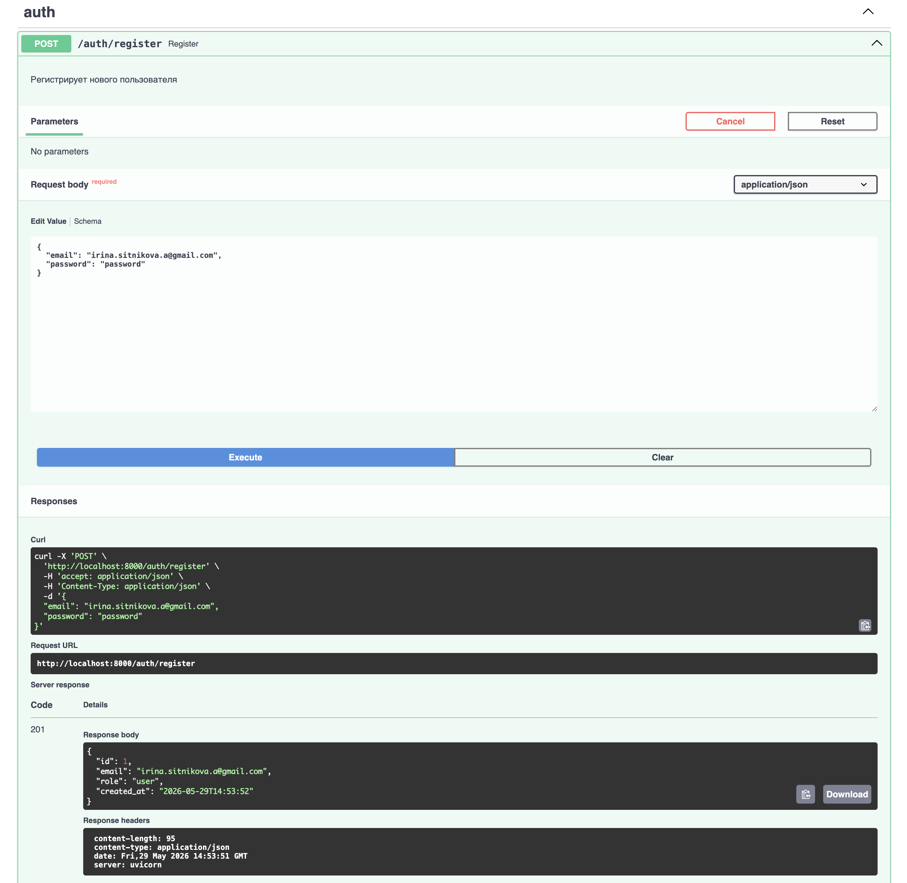

- Логин и получение токена (`POST /auth/login`)

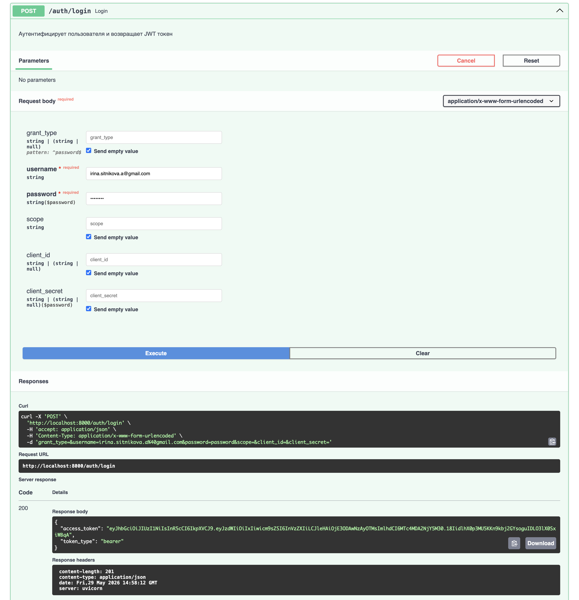

- Авторизация в Swagger UI

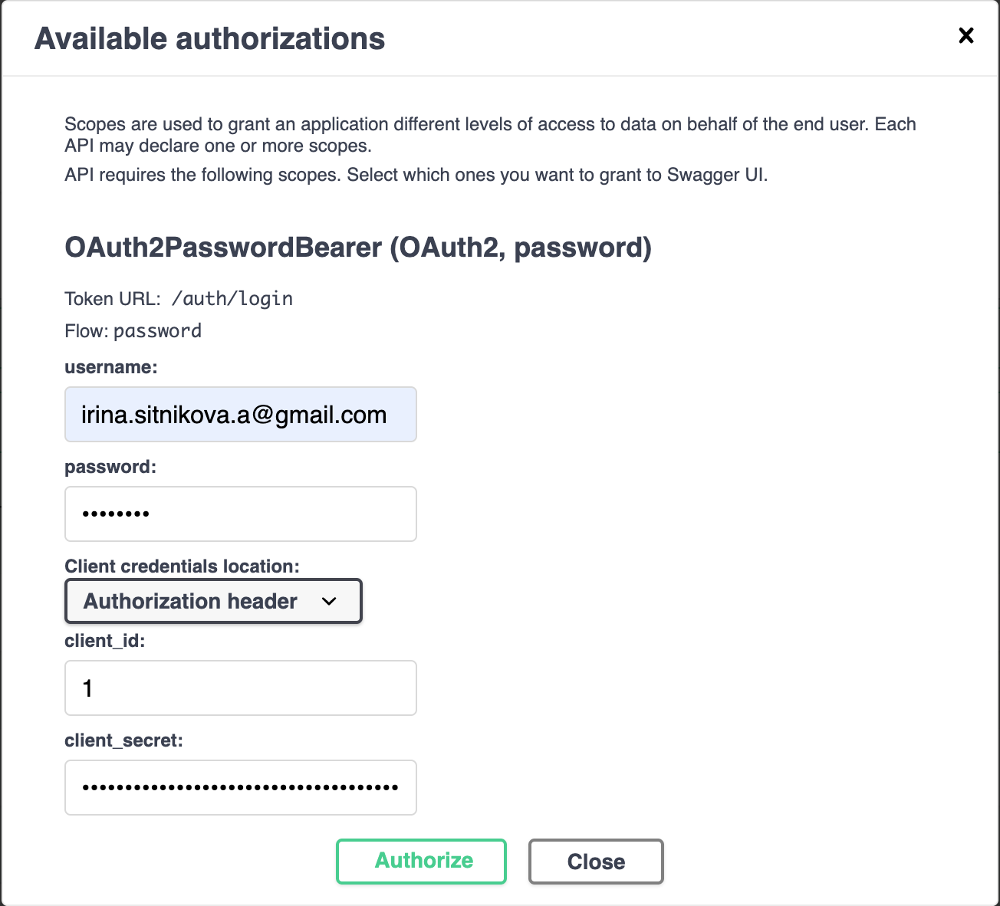

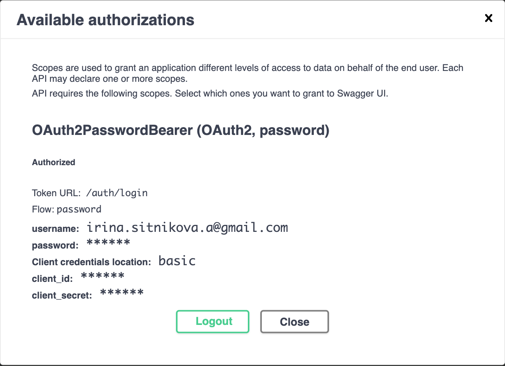

- Получение профиля по токену (`GET /auth/me`)

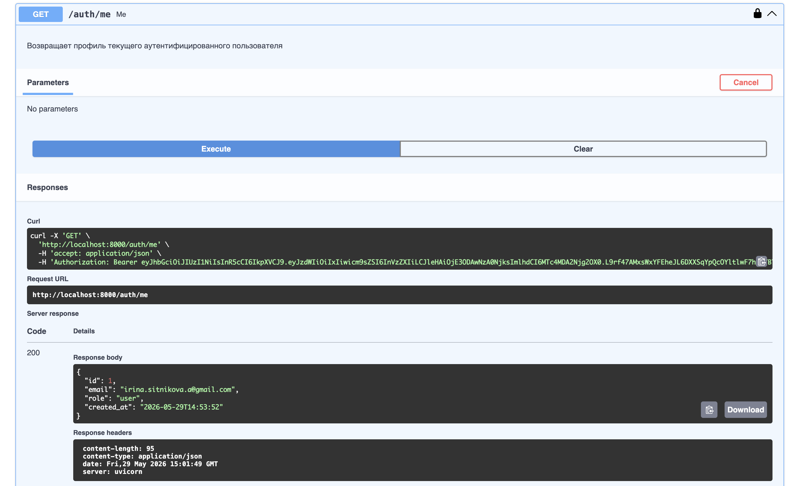

- Проверка работоспособности (`GET /health`)

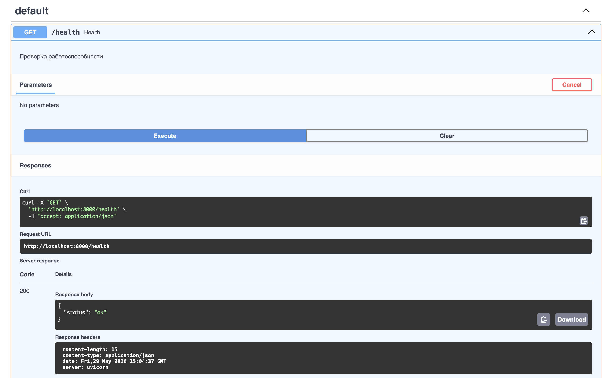

### 2. Telegram Bot

- Команда `/start`

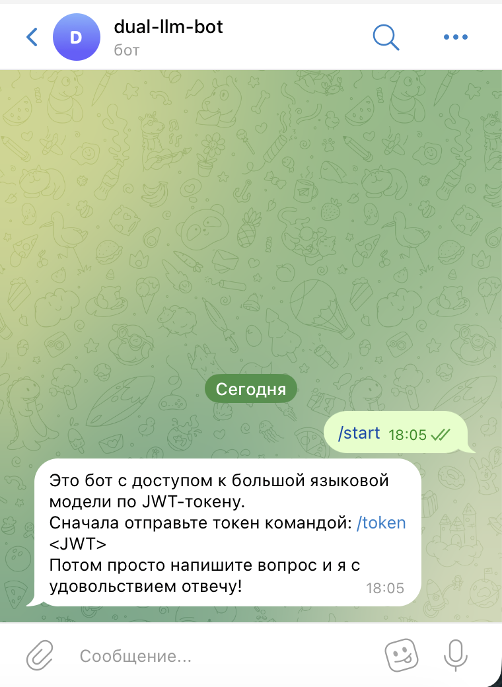

- Сохранение JWT токена (`/token`)

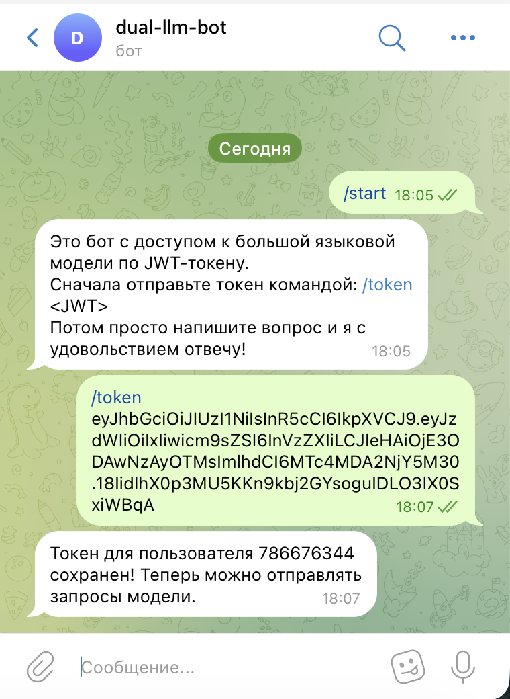

- Запрос к LLM и ответ

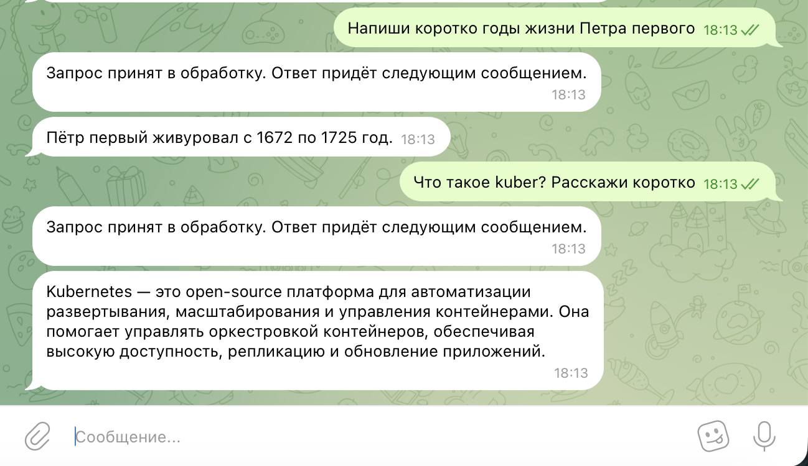

### 3. RabbitMQ

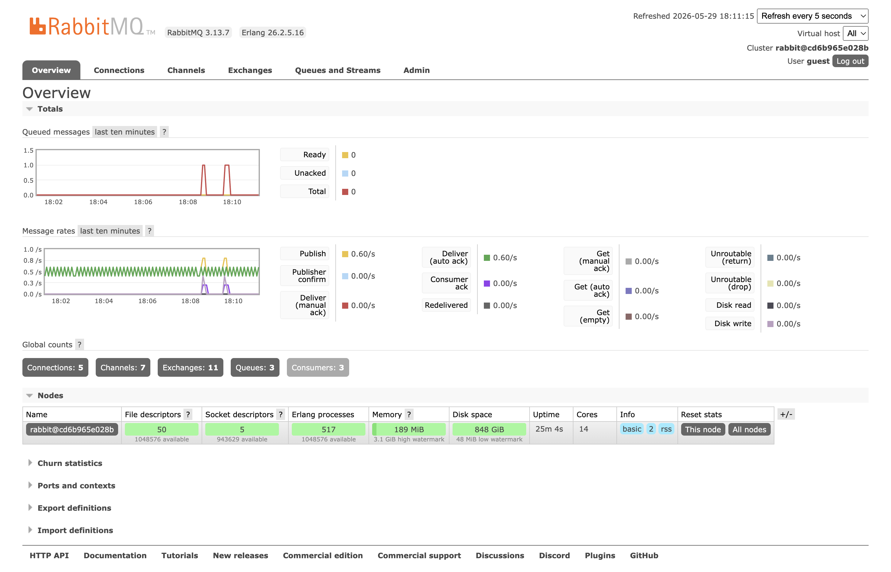

# Тестирование

Тесты покрывают отдельные функции, интеграционные сценарии и обработчики с моками. Для запуска не нужны реальные Redis, RabbitMQ, Telegram или OpenRouter: используются `fakeredis`, `respx`, `pytest-mock`, `ASGITransport` и SQLite в памяти.

### Auth Service тесты

| Тип тестов | Файлы | Что проверяют |
|------------|-------|---------------|
| Модульные | `test_security.py` | Хеширование паролей через bcrypt, создание и проверку JWT (`sub`, `role`, `iat`, `exp`) |
| Модульные | `test_repositories.py` | Операции репозитория пользователей: `create`, `get_by_email`, `get_by_id` |
| Модульные | `test_usecases.py` | Основные сценарии auth-логики: регистрация, вход, получение профиля |
| Интеграционные | `test_api.py` | HTTP API и статусы ответов (201, 200, 401, 409, 422) через `ASGITransport` + `in-memory SQLite` |

Запуск тестов:

```bash
docker compose exec auth_service pytest tests/ -v
```

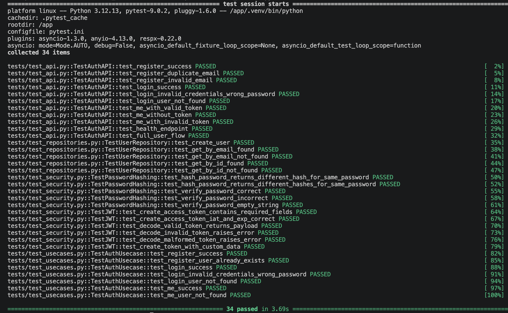

### Bot Service тесты

| Тип тестов | Файлы | Что проверяют |
|------------|-------|---------------|
| Модульные | `test_jwt.py` | Проверку JWT для валидных, истёкших, пустых, повреждённых и неверно подписанных токенов |
| Мок-тесты | `test_handlers.py` | Поведение команд `/start`, `/token`, текстовых сообщений без токена, с токеном и с истёкшим токеном |
| Интеграционные | `test_openrouter.py` | Клиент OpenRouter API: успешный ответ, ошибки, payload и headers через `respx` |

Запуск тестов:
```bash
docker compose exec bot_api pytest tests/ -v
```

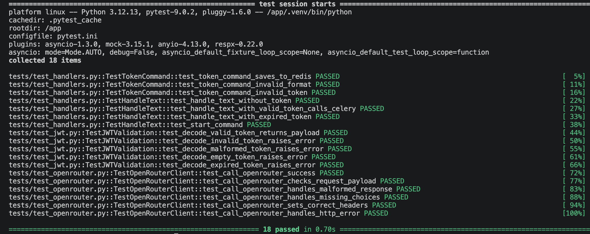

# Линтер

Для статической проверки используется `ruff`. Команды запускаются из корневой директории проекта внутри контейнеров:

```bash
docker compose exec auth_service uv run ruff check
docker compose exec bot_api uv run ruff check
```

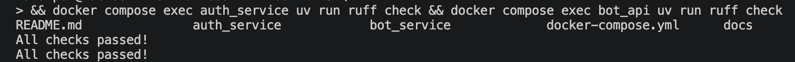
